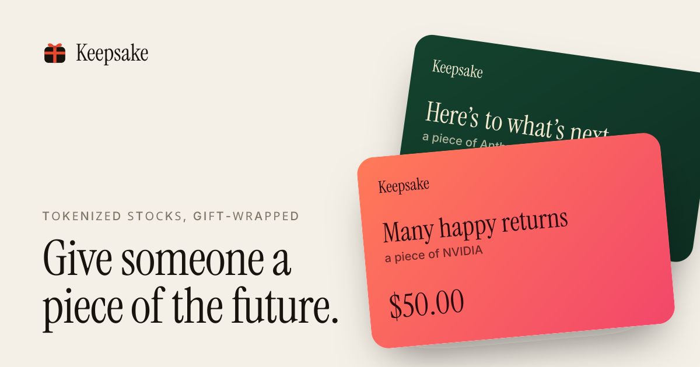
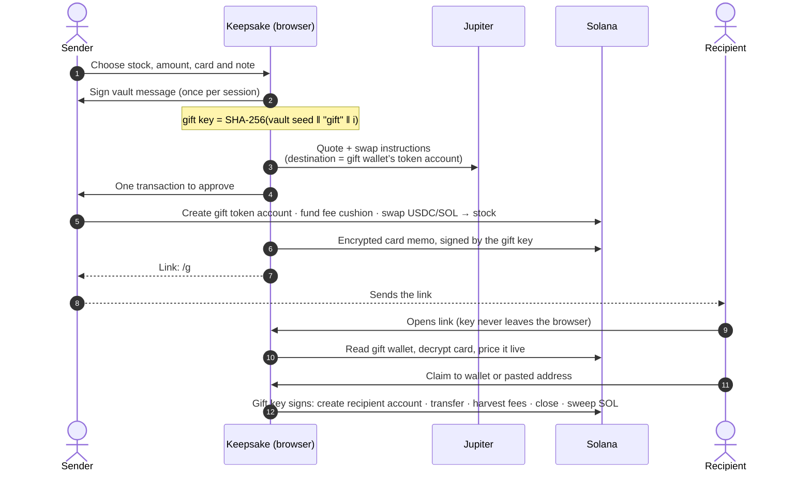

<div align="center">



# Keepsake

**Gift a real share in a link.**

Wrap a piece of NVIDIA, the S&P 500, or Anthropic before its IPO in a card, and send it anywhere in the world.
They open the link, tap claim, and it’s theirs. No brokerage account, no paperwork, no borders.

Built on Solana with tokenized stocks from **xStocks** and **PreStocks**, routed by **Jupiter**, with market data from **Pyth Network**.

**[keepsake-gifts.vercel.app](https://keepsake-gifts.vercel.app)**

[Open a sample gift](https://keepsake-gifts.vercel.app/g#demo) · [How it works](#how-it-works) · [Architecture](#architecture) · [Security model](#security-model)

</div>

---

## The problem

People have always wanted to give a stake in the future: a first share for a newborn, a graduation gift, a thank-you to a team. Giving a stock is still stuck in the past.

- **It stops at the border.** A brokerage can usually only move shares to another account in the same country, at the same firm.
- **It takes paperwork.** Custodial accounts for children need forms, ID checks and days of waiting before anything changes hands.
- **It locks you in.** Stock gift cards keep the gift inside one company’s app, in one market, with fees on the way out.

So most people give cash, or a gift card to a store, and the moment passes.

## The product

Tokenized stocks on Solana turn a share into something you can hand over. Keepsake adds what makes it a *gift*: a card, a note, a link, and the moment of opening it.

| For the sender | For the recipient |
| --- | --- |
| Pick from the S&P 500, Nasdaq 100, big tech, or pre-IPO companies like Anthropic, OpenAI and SpaceX | Opens a link from any messaging app, email or printed QR code |
| Pay with USDC or SOL; **one signature** buys the shares straight into a fresh gift wallet | Sees the card, the note, what’s inside and what it’s worth right now |
| Choose a card for the occasion and write a private note | Claims to **any** Solana wallet, even a brand-new empty one; the gift pays its own fees |
| Share by link, WhatsApp, native share sheet, or print a card with a QR code | Receives a little SOL alongside, so they can move or sell it straight away |
| Rebuild every link from **My gifts** on any device, and reclaim anything left unopened | Can trade it 24/7, including when Wall Street is closed |

Keepsake charges no fee. Senders pay the stock price through Jupiter’s best route plus about 0.005 SOL, which travels inside the gift and ends up in the recipient’s wallet.

## Try it

- **Send a gift:** [keepsake-gifts.vercel.app/create](https://keepsake-gifts.vercel.app/create). Connect Phantom, Solflare, Backpack or any Wallet Standard wallet.
- **See what a recipient sees:** [open a sample gift](https://keepsake-gifts.vercel.app/g#demo), which opens a sample gift built from live prices, with no funds involved.
- **Manage your gifts:** [My gifts](https://keepsake-gifts.vercel.app/gifts) shows everything you’ve wrapped, its status and live value, with one-tap reclaim.

## How it works



### 1. Wrapping

The sender’s browser derives a new gift wallet, then builds a single versioned transaction that:

1. creates the gift wallet’s associated token account for the chosen stock (Token-2022 aware),
2. funds the gift wallet with a small SOL cushion for the recipient’s claim, and
3. executes a Jupiter swap from USDC or SOL **directly into the gift wallet** via `destinationTokenAccount`.

Buying straight into the gift saves a transfer, which matters for PreStocks tokens because they charge a 1% issuer fee on every transfer. Jupiter’s simulated compute limit is raised to cover the setup instructions, and routes are capped at 44 accounts so the transaction stays well under the size limit.

### 2. The card

The card (names, note, theme, value at wrapping) is encrypted with AES-GCM using a key derived from the gift key, and written to the chain as a memo **signed and paid for by the gift wallet itself**. Only someone holding the link can read it. The link also carries a copy of the card after the key, so it opens instantly even before the memo is indexed.

### 3. Claiming

The claim transaction is signed by the gift key and paid for by the gift wallet, so the recipient needs nothing but an address. In one atomic transaction it:

1. creates the recipient’s token account (idempotent),
2. transfers the full balance with `transferChecked`,
3. harvests any Token-2022 withheld transfer fees back to the mint, which a fee-bearing account needs before it can be closed,
4. closes the gift’s token account and reclaims its rent, and
5. sweeps every remaining lamport to the recipient.

The rent arithmetic is exact, so the gift wallet ends at zero. If a simulation shows the exact close-out would fail, the claim falls back to leaving a rent-exempt reserve behind rather than failing.

### 4. The vault

Gift keys are never stored. Each one is derived from a single `signMessage` signature:

```
vault seed = SHA-256("keepsake/vault/v1" ‖ ed25519 signature of the vault message)
gift key i = SHA-256(vault seed ‖ "gift" ‖ u32be(i))
```

Ed25519 signatures are deterministic, so the same wallet always produces the same vault. **My gifts** walks the slots until it finds a run of unused ones, rebuilds every link, decrypts every card, and offers one-tap reclaim for anything unopened. There is no database, no account and no server-side state. Wallets without `signMessage` fall back to random gift keys remembered on the device.

## Architecture

```
src/
├── app/
│   ├── page.tsx                 Landing page
│   ├── create/                  Gift composer: picker, live quote, card designer, wrap flow
│   ├── g/                       Recipient experience: unwrap, live value, claim
│   ├── gifts/                   Sender vault: status, live value, re-share, reclaim
│   ├── api/market/              Market snapshot (xStocks, PreStocks, Jupiter, Pyth)
│   ├── api/swap/                Jupiter quote and swap-instruction relay
│   ├── api/rpc/                 Allow-listed Solana JSON-RPC relay
│   └── opengraph-image.tsx      Social cards for the site and for gift links
├── components/                  Gift card, share sheet, ticker, wallet UI
└── lib/
    ├── gift.ts                  Gift wallets, links, encrypted cards, wrap and claim transactions
    ├── vault.ts                 Deterministic gift-key derivation and discovery
    ├── market.ts                Asset catalogue, prices, scaled-UI multipliers
    ├── pyth.ts                  Pyth market hours and equity prices
    └── catalog.ts               Supported xStocks and payment tokens
```

The server holds no user data. It aggregates public market data, relays Jupiter requests, and forwards an allow-listed set of RPC methods so that a private RPC key never reaches the browser. Every transaction is built and signed client-side.

### Integrations

| Partner | Role in Keepsake |
| --- | --- |
| **xStocks** | Backed tokenized US equities and ETFs (SPY, QQQ, NVDA, AAPL, GLD and more), Token-2022 with scaled-UI multipliers for corporate actions |
| **PreStocks** | Pre-IPO companies (Anthropic, OpenAI, SpaceX, Anduril, Neuralink, Figure, Kalshi, Polymarket), loaded live from the PreStocks API with implied valuation and premium to mark |
| **Jupiter** | Best-route swaps from USDC or SOL straight into the gift wallet; live prices and token metadata |
| **Pyth Network** | NYSE session state and market hours shown throughout the app; live prices of the listed underlying share next to each xStock |

### Token details handled

- **Token-2022 everywhere.** Both issuers use Token-2022, so accounts are derived and instructions built against the right program.
- **Scaled UI amounts.** xStocks apply a multiplier for dividends and splits. Keepsake values raw balances with the pre-scaled price, and shows shares with the current multiplier, respecting `newMultiplierEffectiveAt`.
- **Transfer fees.** PreStocks’ 1% transfer fee is shown before wrapping, avoided on the purchase by swapping directly into the gift, and its withheld amount is harvested before the gift account closes.

## Security model

- **The link is the key.** The gift key lives in the URL fragment, which browsers never send to servers. Keepsake has no copy.
- **Bearer semantics are explicit.** Whoever opens a link first can claim it. The sender is told this before wrapping, can take back any unopened gift at any time, and can re-share lost links from the vault.
- **Non-custodial end to end.** The sender signs one transaction in their own wallet. The claim is signed by the gift key in the recipient’s browser. No Keepsake server can move funds.
- **Private cards.** Card contents on-chain are AES-GCM encrypted with a key derived from the gift key.
- **Minimal server surface.** The RPC relay forwards only the read and submit methods the app uses, with batch limits. Gift pages send no referrer and are excluded from indexing.

## Why Solana

A gift should settle when it’s given, not at the next market open. Tokenized stocks on Solana trade around the clock; a gift wraps in about a second, costs a fraction of a cent in network fees, and can be opened by anyone with an internet connection. Account abstraction is not needed: a disposable keypair that pays its own fees is enough to give someone with an empty wallet a one-tap claim.

## Tech stack

Next.js 16 (App Router), React 19, TypeScript, Tailwind CSS 4, `@solana/web3.js`, `@solana/spl-token`, Solana Wallet Adapter, Motion, `next/og`.

## Development

```bash
npm install
npm run dev
```

| Variable | Required | Purpose |
| --- | --- | --- |
| `SOLANA_RPC_URL` | Recommended | Mainnet RPC used by the relay. Defaults to the public endpoint, which is rate-limited. |
| `PYTH_API_KEY` | Optional | Enables live Pyth prices for the listed underlying shares. Market hours work without it. |
| `JUPITER_API_KEY` | Optional | Uses Jupiter’s keyed API instead of the public tier. |
| `NEXT_PUBLIC_SITE_URL` | Optional | Canonical URL for metadata and social cards. |

## Roadmap

- **Gift drops:** one transaction that wraps dozens of gifts for a team, a classroom or a community.
- **Scheduled gifts:** wrap now, reveal on the birthday.
- **Group gifts:** friends chip into one gift from their own wallets.
- **Baskets:** a single gift holding a small index of several companies.
- **Blinks:** claim straight from a post on X through Solana Actions.

## Disclaimer

Keepsake is non-custodial software and does not hold funds or gift keys. Tokenized stocks are issued by third parties and aren’t available in every jurisdiction; for example, xStocks are not offered to US persons. Prices move, and a gift can be worth less than was paid for it. Nothing in this project is investment advice.

## License

[MIT](LICENSE)
